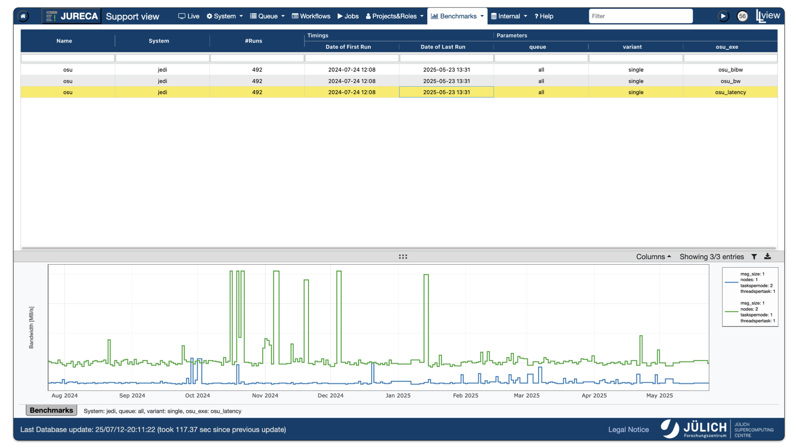

---
hide:
  - toc
---
# Continuous Benchmarks

<figure markdown>
  { width="800" }
  <figcaption>LLview Continuous Benchmark interface, showing OSU benchmark results for JEDI</figcaption>
</figure>

LLview makes it simple to track performance over time by:

- **Automatic result collection**  
  Pull benchmark outputs (for example, CSV files) directly from your GitLab repository or any watched folder.

- **Customizable summary tables**  
  Choose which parameters (problem size, thread count, compiler flags, etc.) define rows and columns. LLview then generates a complete table of every combination for you—no manual work.

- **Multi‑curve performance graphs**  
  Assign any parameter to its own line or curve. LLview automatically plots all combinations so you can compare, for example, different MPI ranks, compiler versions, or hardware types at a glance.

- **Embedded metadata**  
  Include extra context such as job IDs, Git commit hashes, build timestamps or any custom field right in your graph labels, when that information is available.

- **Fully configurable style**  
  Control colors, line styles, axis labels, legends and more through your YAML settings to match your team’s branding and readability needs.
