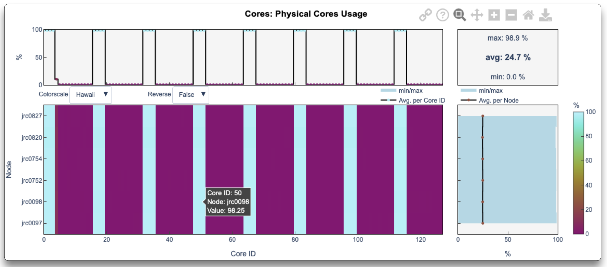
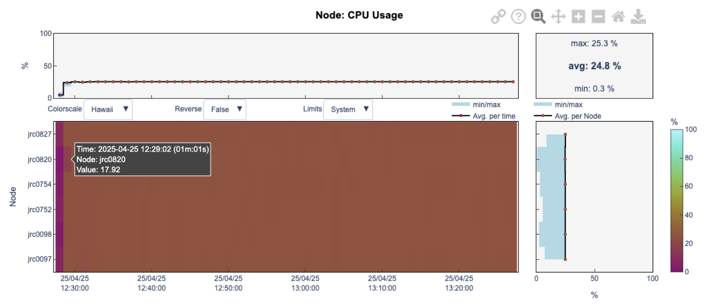

---
hide:
  - toc
---
# Metric Graphs

LLview's detailed reports visualise each metric using interactive heatmaps (colour maps) that highlight resource usage patterns. See [here the full list of metrics](metrics_list.md).

!!! info
    • **X‑axis**: either job **timestamp** or **core ID**  
    • **Y‑axis**: resource dimension (node, GPU, superchip)  
    • **Colour**: metric value at each (X,Y) point

<figure markdown>
  { width="800" }
  <figcaption>Heatmap of a metric across core IDs (X) and node names (Y)</figcaption>
</figure>

<figure markdown>
  { width="800" }
  <figcaption>Heatmap of a metric over time (X) and node names (Y)</figcaption>
</figure>

Other examples can be seen [here](examples.md).

Above and beside each heatmap you'll also find three summary curves:

- **Per‑timestamp** (top): min, average and max values across all resources at that time.  
- **Per‑resource** (right): time‑averaged value per node/GPU/superchip, including its min–max range.  
- **Global summary** (top‑right): overall min, average and max for the entire job.

!!! info
    - **Interactive features**:  
        - **Hover**: display exact values and metadata at the pointer.  
        - **Zoom & Pan**: click-and-drag or axis controls to focus on regions of interest.  
        - **Color-scale dropdowns**: choose or reverse the colour map; switch between job-level or system-level bounds.  
        - **Menubar (hover)**: copy a direct link to the graph, view its title/description, use zoom/pan buttons, or **download** the data as JSON.

Use these heatmaps and interactive tools to pinpoint hotspots, compare resources over time, and deep-dive into performance trends.

