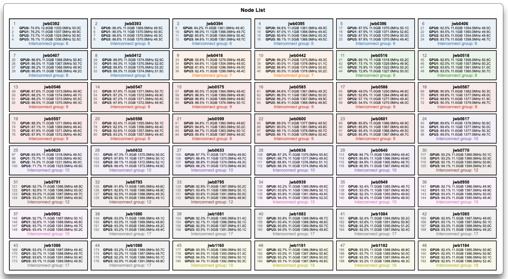

---
hide:
  - toc
---
# Node List

<figure markdown>
  { width="800" }
  <figcaption>Allocated nodes coloured by interconnect group</figcaption>
</figure>

The **Node List** displays every allocated node as a labelled box, coloured by its **interconnect group**—a logical grouping that indicates network proximity (nodes sharing a colour are more tightly connected).

When a node encounters an error, its box border turns red to highlight the issue.

Inside each node box:

- **Node name** (e.g., `node001`).
- **GPUs** (if present): each GPU is numbered and shows key metrics:  
  - Average GPU Active SM (%) or Utilization (%)  
  - Average memory usage (MiB) or memory usage rate (%)  
  - Average SM clock frequency (MHz) and temperature (°C)

Use this layout to quickly identify:

- Which nodes are in the same interconnect group (for communication locality).  
- GPU performance variations across nodes.  
- Outliers or imbalances in resource usage before inspecting detailed graphs.  
- Which nodes experienced errors (outlined in red).

