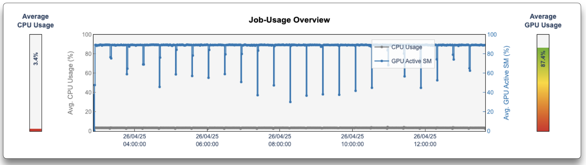

---
hide:
  - toc
---
# Usage Overview Graph

<figure markdown>
  { width="800" }
  <figcaption>Time-series trends and overall averages for CPU and GPU usage</figcaption>
</figure>

This graph shows how your job's compute resources were utilised over time and in aggregate:

- **Time-series plot**  
    - **CPU** (grey line): displays **CPU usage** (%) when that metric is available; if not, it falls back to **CPU load**.  
    - **GPU** (coloured line, GPU jobs only): shows **GPU Active SM** (%) if supported, otherwise **GPU Utilization** (%).

- **Overall averages**  
    - **Left bar**: average CPU usage (or load) over the entire job.  
    - **Right bar**: average GPU usage across all GPUs (only shown for GPU jobs).

Use this overview to quickly:

1. Spot periodic dips or spikes in CPU or GPU activity.  
2. Compare CPU and GPU utilisation at a glance.  
3. Confirm balanced use of available resources throughout the run.

