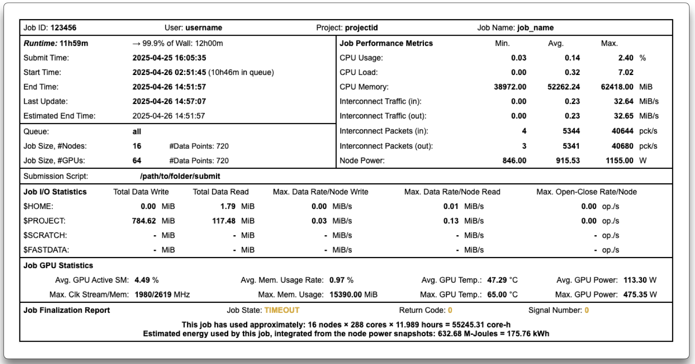

---
hide:
  - toc
---
# Overview Table

<figure markdown>
  { width="800" }
  <figcaption>Job summary and key metrics</figcaption>
</figure>

The **Overview Table** at the top of each detailed report provides a concise summary of your job:

- **Job & User**: ID, name, user and project.
- **Timing**: runtime, submit/start/end times and queue wait.
- **Resources**: number of nodes & GPUs with number of timestamp data-point counts.
- **Script**: path to the submission script (or indication of interactive jobs).
- **Performance**: min/avg/max statistics for CPU, interconnect traffic, packets and node power.
- **I/O**: total read/write (MiB) and peak rates per filesystem.
- **GPU**: average SM occupancy, memory usage rate, temperature and power.
- **Final Status**: job state, return code, core‑hours used and estimated energy.

Use this summary to spot issues at a glance before diving into the detailed graphs.

