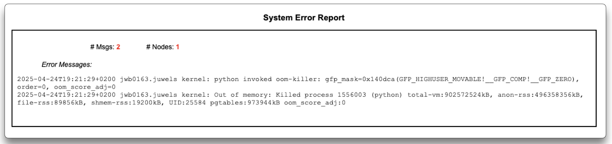

---
hide:
  - toc
---
# System Errors

<figure markdown>
  { width="800" }
  <figcaption>Example of an Out-of-Memory (OOM) system error</figcaption>
</figure>

At the end of each detailed report, LLview lists **System Errors** detected during your job run (when that is the case). These include errors emitted from the system side, which users usually do not have access to.

Common system errors include:

- **Out-of-Memory (OOM)**: Jobs killed by the node's oom-ripper when exceeding available memory.  
- **Node Failures**: Hardware or network issues on a node.  
- **Interconnect Link Failures**: link failures (see more details about "Flipping links" [here](https://apps.fz-juelich.de/jsc/hps/juwels/known-issues.html#flipping-links)).

Use this information to:

- Diagnose whether failures were due to your code or system instability.  
- Identify problematic nodes or links that may need attention.  
- Correlate error timestamps with performance plots to pinpoint root causes.  

