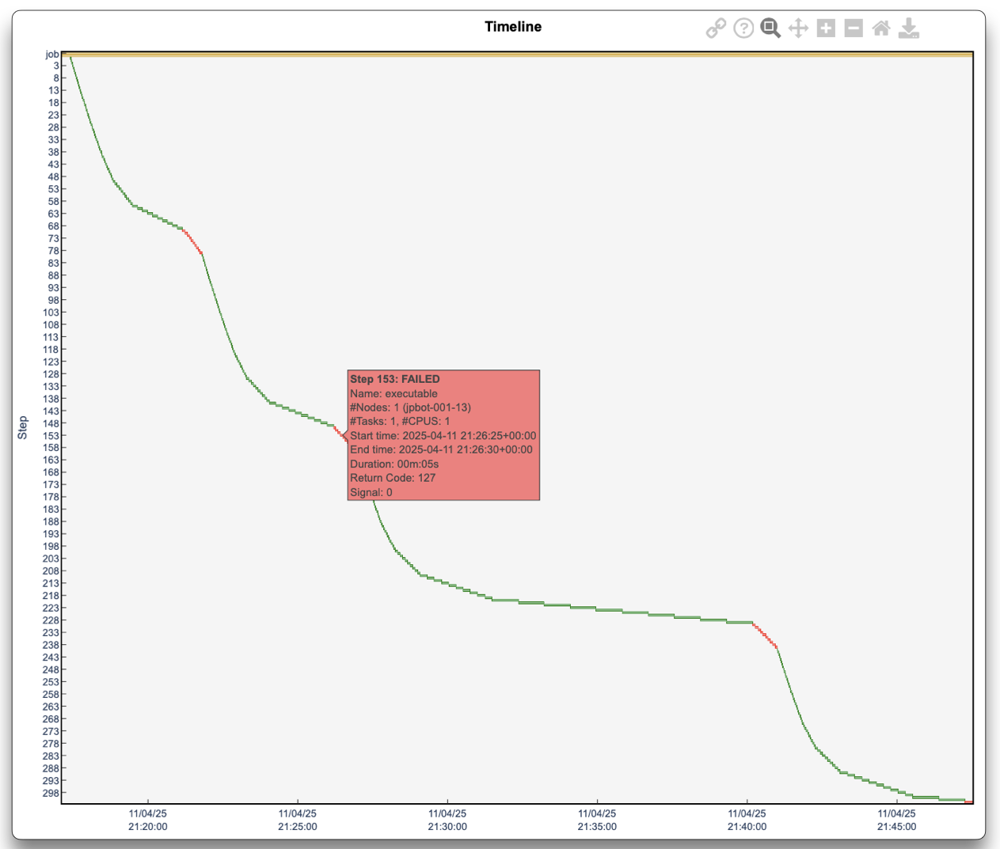

---
hide:
  - toc
---
# Timeline

<figure markdown>
  { width="800" }
  <figcaption>Job and step timelines coloured by state</figcaption>
</figure>

The timeline shows the full job and each step as horizontal bars coloured by state:

- **Blue**: Running  
- **Green**: Completed  
- **Yellow**: Timeout  
- **Red**: Failed

!!! info
    - **Static PDF view**: provides an immediate overview of when the job and its steps occurred.
    - **Interactive HTML**:  
        - Hover for details: job/step name, status, nodes, tasks, CPUs, start/end times, duration, return code, signal.  
        - Click a bar to zoom the X‑axis to that step's timespan.  
        - Top‑right menubar (on hover) lets you copy a link, use zoom/pan buttons, or download the data as JSON.

Use this timeline to trace job flow, identify slow or failed steps, and correlate them with performance metrics.

